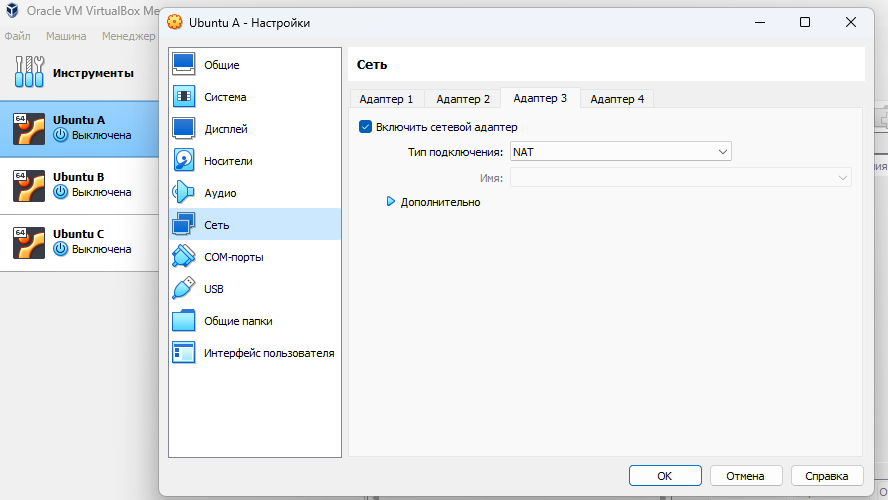

# Отчет по лабораторной работе №3
## Настройка машины А
Необходимо настроить доступ машины в интернет и проверить доступ через терминал.
Для начала настроим сеть, для этого зайдём в настройки машины A, в сеть и выберем тип подключения 'NAT'.

Затем проверим подключение используя команду 'ping 8.8.8.8' в терминале машины А.

## Обеспечение сетевого доступа от машины А к машине Б 
Необходимо соединить машины А и Б одной внутренней сетью и проверить подключение из каждой машины в другую.
Настроим сеть для А: в настройках сети подключаем ещё один адаптер и выбираем тип подключения 'Внутренняя сеть' и назоваем её (на рисунке название Ubuntu B).

Для машины Б нет необходимости включать новый адаптер, на первом выбираем тип 'Внутренняя сеть' и сеть, названную как для машины А.

Затем выдадим нашим машинам ip адреса, маски и шлюз (для машины Б) для внутренней сети. Машине А можем выдать ip '192.168.1.1' (192.168.0.1 давать не стоить, есть риск потерять соединение с интернетом) и маску '255.255.255.0'.
Для машины Б выдаём ip отличный от ip для машины А, например '192.168.1.2', такую же маску как и для машины А '255.255.255.0' и в качестве шлюза вводим ip машины А.

Затем проверяем соединение используя ping и ip адрес другой машины.

 
## Обеспечение сетевого доступа от машины А к машине В
Необходимо соединить машины А и В одной внутренней сетью, к которой не имеет доступа машина Б и проверить подключение между машинами.
Настроим сеть для А и В по примеру [Обеспечение сетевого доступа от машины А к машине Б](#first). Во время выдачи ip для машины А и В учтём, что ip вида '192.168.1...' - занят, и дадим ip вида '192.168.2..'.
Затем проверим подключение каждой машины к другим.

