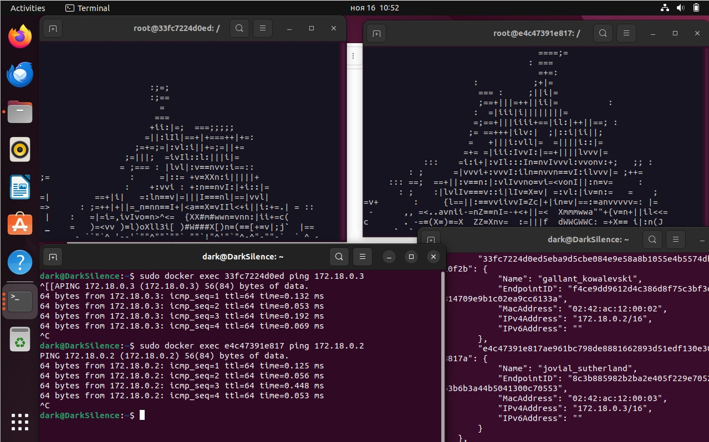

# Отчет по лабораторной работе №4
## Запуск aafire в контейнере
Необходимо создать Dockerfile с установленными в него ping и libaa-bin (aafire).

Затем запустим соберём образ этого контейнера чиспользуя комманду: "docker build -t aafire .". Запустим этот контейнер и подключимсся к нему командой: "docker run -it aafire", внутри запущенного контейнера включим aafire.

## Обеспечение связи между контейнерами
Запустим второй контейнер с aafire, а затем создадим сеть, используя комманду "docker network create myNetwork", и добавим оба контейнера в эту сеть: "docker network connect myNetwork [container name]".
Затем через команду "docker network inspect myNetwork" находим ip-адреса добавленных контейнеров. Через терминал, запущенный отдельно от контейнеров, запустим две комманды поочерёдно: "docker exec [container name] ping [another container ip]"

